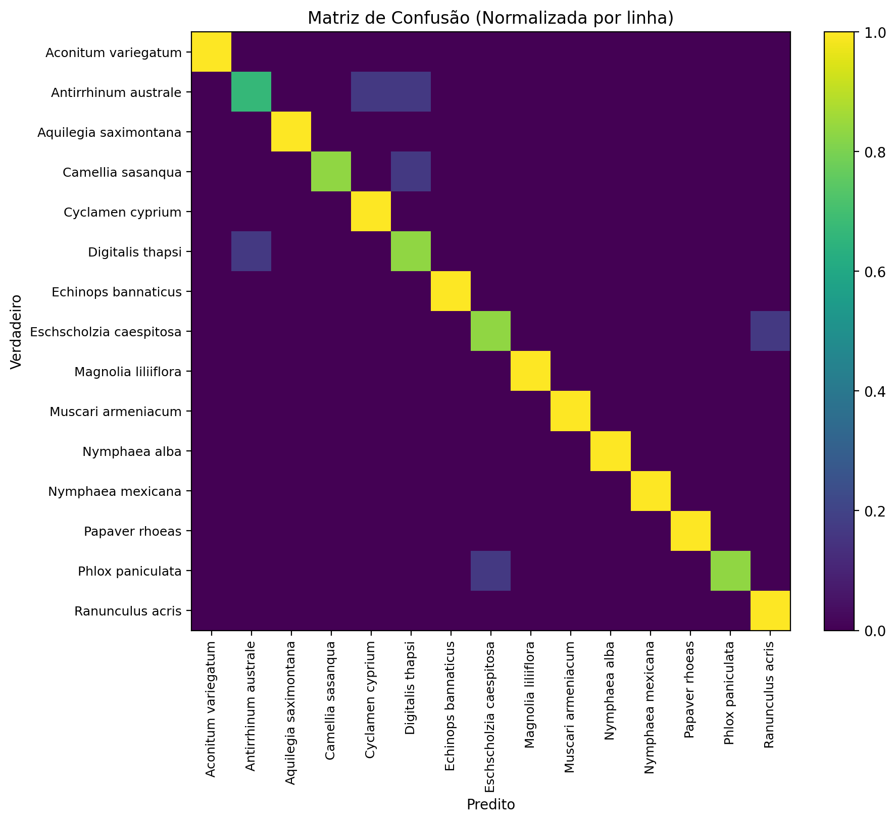

# Projeto de Classificação de Flores

## Descrição do Projeto

<!-- Imagem centralizada -->
<p align="center">
   
   
</p>

Este projeto tem como objetivo disponibilizar um **conjunto de dados de imagens de flores** organizado por classes, destinado a tarefas de **visão computacional**, como **classificação de imagens** e **treinamento de modelos de aprendizado de máquina / deep learning**.

O dataset inclui imagens originais e versões **aumentadas artificialmente (data augmentation)**, permitindo melhorar a generalização de modelos treinados com poucos dados.


## Estrutura do Projeto

A organização dos arquivos segue o padrão abaixo:

    dados/
    └── flores_train/
    ├── Eschscholzia caespitosa/
    │   ├── image_XXXXX.jpg
    │   ├── image_XXXXX_aug1.jpg
    │   ├── image_XXXXX_aug2.jpg
    │   └── ...
    ├── Magnolia liliiflora/
    ├── Muscari armeniacum/
    ├── Nymphaea alba/
    └── Nymphaea mexicana/
    ...


- Cada **pasta representa uma classe de flor**
- As imagens com sufixo `_augX` são versões aumentadas da imagem original


## Classes de Flores

O dataset contém imagens das seguintes espécies:

- **Aconitum variegatum**
- **Antirrhinum australe**
- **Aquilegia saximontana**
- **Camelia sasanqua**
- **Cyclamen cyprium**
- **Digitalis thapsi**
- **Echinops bannaticus**
- **Eschscholzia caespitosa**
- **Magnolia liliiflora**
- **Muscari armeniacum**
- **Nymphaea alba**
- **Nymphaea mexicana**
- **Papaver rhoeas**
- **Phlox paniculata**
- **Ranunculus acris**


## Data Augmentation

Para aumentar a diversidade dos dados e reduzir overfitting, foram aplicadas técnicas de **data augmentation**, como:

- Rotação
- Espelhamento horizontal/vertical
- Alterações leves de escala ou perspectiva

Cada imagem original possui múltiplas variações, identificadas pelo sufixo:

```

image_XXXX.jpg        -> imagem original
image_XXXX_aug1.jpg   -> variação 1
image_XXXX_aug2.jpg   -> variação 2
...

```


## Objetivo de Uso

Este dataset pode ser utilizado para:

- Treinamento de **redes neurais convolucionais (CNNs)**
- Estudos de **classificação de imagens**
- Projetos acadêmicos e experimentos em **Machine Learning**
- Testes de técnicas de **data augmentation**

Compatível com bibliotecas como:
- TensorFlow / Keras
- PyTorch
- Scikit-learn (com extração de features)


## Como Utilizar

Exemplo em Python para o treinamento do modelo (menos poder computacional, mais rapidez):

```bash
  python treino_mobilenet_new.py
```

Ou então (mais poder computacional, mais precisão):

````bash
  python treino_resnet_new.py
````


Exemplo em Python para a validação do modelo:

```bash
  python avaliar_modelo.py
```

Ou então (escolhendo o modelo treinado e os dados):

````bash
  python avaliar_modelo.py --model_path mobilenetv2_best.pth --data_dir dados/flores_train
````


## Observações e resultados

* O dataset está organizado apenas para **treinamento**
* Caso necessário, recomenda-se criar subconjuntos de **validação** e **teste**
* Verifique o balanceamento entre as classes antes do treinamento

<!-- acuracia centralizada -->
Matriz de confusão do modelo mobilenet:
<p align="center">
   
</p>


## Licença

Este projeto é destinado a fins **educacionais e de pesquisa**.
Caso utilize em trabalhos acadêmicos ou projetos públicos, cite a fonte adequadamente.


## Autor

Projeto desenvolvido para estudos em **Visão Computacional e Aprendizado de Máquina** na disciplina de **aprendizado profundo** da Universidade Federal do Ceará, ministrada pelo professor Dr. Julio César Santos dos Anjos, juntamente com seus discentes.

**Turma CD VI - 2025**
Projeto ItapajéBio (Classificação de Flora e Sons de Pássaros)

